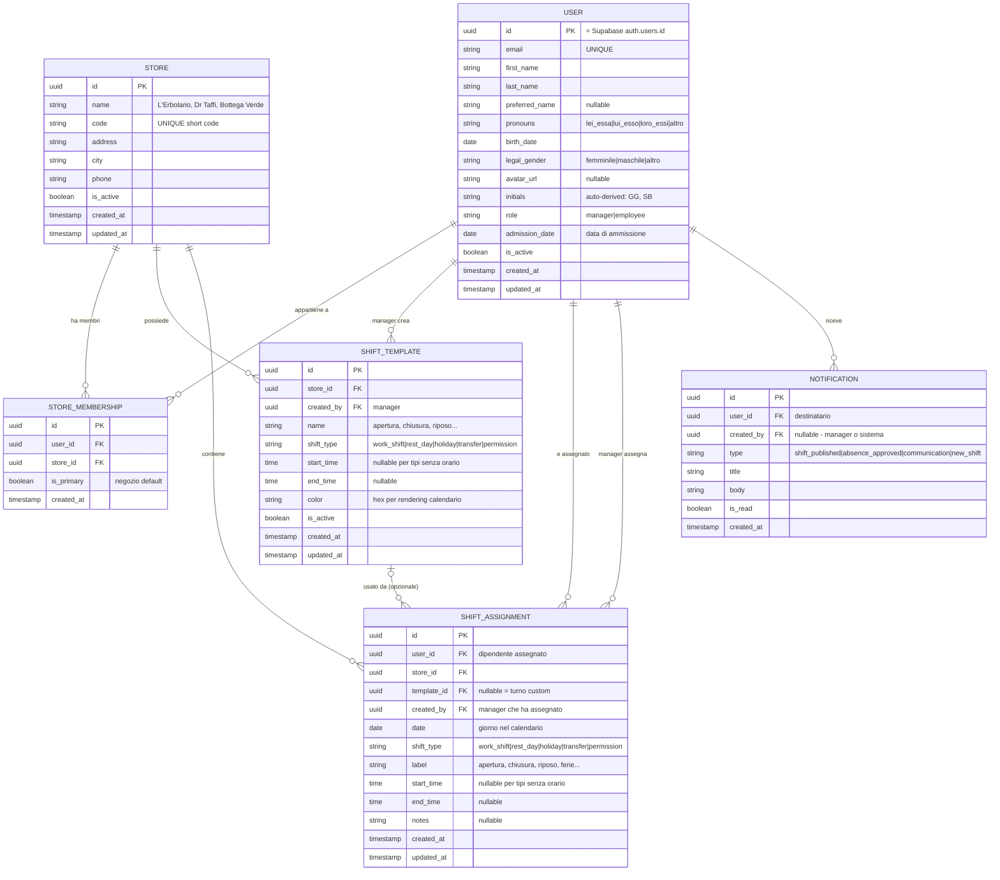

# PRD: Factorial App - Gestione Turni PWA

## Context

Sviluppo di una Progressive Web App per una catena di negozi erboristeria (L'Erbolario, Dr Taffi, Bottega Verde) per la gestione dei turni del personale da utilizzare da mobile e web. Il cliente (proprietario) ha bisogno di uno strumento per pianificare i turni dei dipendenti, gestire assenze, ed esportare report in PDF. L'app segue il design system "Botanical Editorial" con estetica naturale/botanica. I mockup in `Mockup/` definiscono il look & feel.

**Stack confermato:** Supabase (DB + Auth) + Vercel (deploy) + Next.js + React + TypeScript + Tailwind CSS

---

## 1. Panoramica Prodotto

| Campo | Valore |
|-------|--------|
| **Nome** | Factorial App |
| **Tipo** | Progressive Web App (PWA) |
| **Target** | Catena erboristeria, 2-3 negozi, ~10-15 dipendenti |
| **Design System** | Botanical Editorial (Manrope, verde foresta #234428, sfondo crema #fcf9f4) |
| **Database** | Supabase (PostgreSQL) |
| **Auth** | Supabase Auth (email + password) |
| **Deploy** | Vercel |

## 2. Ruoli Utente

| Ruolo | Permessi |
|-------|----------|
| **Manager** (proprietario) | CRUD turni nel calendario, gestione assenze, esportazione PDF, gestione profili, notifiche |
| **Dipendente** | Visualizzazione turni propri e colleghi (read-only), profilo personale, ricezione notifiche |

## 3. Navigazione (3 tab)

```
Bottom Navigation (glassmorphism, backdrop-blur):
  [Home]  [Calendario]  [Hub]
```

### Tab 1 - Home
- Saluto personalizzato ("Buongiorno, [Nome]!")
- Il MIO turno di oggi (card con orario e tipo)
- Colleghi in servizio oggi (lista chi lavora e in quale turno)
- **NO** timbratura, **NO** notizie/news

### Tab 2 - Calendario (turni PERSONALI)
- Vista calendario SOLO dell'utente loggato
- Vista mensile con navigazione mese
- Griglia settimanale Lun-Dom, giorno selezionabile
- Card dettaglio turno del giorno selezionato (es. "Oggi, 16 Ottobre - apertura 08:30 - 14:30")
- **Ref mockup:** `Mockup/calendario_vista_pulita_senza_consigli/screen.png`

### Tab 3 - Hub (centro operazioni)
- **Turni** - Griglia settimanale di TUTTI i dipendenti. Manager modifica, dipendente visualizza (read-only). **Ref:** `Mockup/turni_stile_verde_mentha_layout_fedele/screen.png`
- **Assenze** - Vista aggregata di ferie, permessi, riposi, trasferte. Gestite esclusivamente dal manager
- **Persone** - Directory di tutti i dipendenti dell'organizzazione (cross-store)

> **RIMOSSO:** Timbra (timbratura) - il cliente non la vuole
> **RIMOSSO:** Documenti - il cliente non li vuole

### Profilo (accessibile dal menu utente):
- **Personale** - nome, cognome, nome preferito, pronomi, data nascita, genere legale
- **Profilo** - manager di riferimento, email aziendale
- **NO** sezione Contratto
- **Security & Preferences** - Face ID toggle, Lingua

### Notifiche (accessibili dalla campanella):
- Pubblicazione turni ("Il tuo orario di lavoro e stato pubblicato")
- Comunicazioni dal manager
- Approvazione ferie
- Nuovi turni disponibili

## 4. Funzionalita Core

### 4.1 Gestione Turni (Manager = CRUD, Dipendente = read-only)

Il manager inserisce TUTTO nel calendario dei turni: turni lavorativi, giorni di riposo, ferie, trasferte, permessi. Ogni voce appare sia nella griglia Turni che nella sezione Assenze (per i tipi non-lavorativi).

**Turni Template (salvabili e riutilizzabili):**
- Il manager crea template con nome, tipo, orario inizio/fine, colore
- Esempi: "apertura 08:30-14:30", "chiusura 14:00-20:00", "riposo"
- Pattern "copy-on-assign": i campi del template vengono copiati nell'assegnazione, modifiche future al template non cambiano assegnazioni passate

**Turni Personalizzati (one-time):**
- Per orari spezzati o occasioni speciali
- Non salvati come template, usati una volta sola
- `template_id = null` nel database

**Turni Multi-blocco (orari spezzati):**
- Un dipendente puo avere 2+ blocchi orari nello stesso giorno
- Es: 08:30-12:30 + 15:00-19:00 = due SHIFT_ASSIGNMENT per lo stesso giorno/utente
- La griglia mostra entrambi i blocchi nella stessa cella

**Tipi di assegnazione nel calendario:**
| Tipo | Codice | Ha orario | Colore |
|------|--------|-----------|--------|
| Turno lavorativo | `work_shift` | Si | Primario verde |
| Giorno di riposo | `rest_day` | No | Grigio |
| Ferie | `holiday` | No | Giallo |
| Trasferta | `transfer` | Si/No | Blu |
| Permesso | `permission` | No | Arancione |

**Vista griglia (ref: mockup Turni):**
- Righe = dipendenti (con avatar e iniziali)
- Colonne = giorni della settimana (Lun-Dom)
- Filtro per negozio (chip: L'Erbolario, Dr Taffi, ecc.)
- Navigazione settimana (< Settimana 13: Mar 2026 >)
- Bordo colorato a sinistra di ogni cella per indicare il tipo
- **Vista predefinita:** settimanale
- **Navigazione temporale:** si puo scorrere fino a 3 mesi nel futuro (es. se oggi e gennaio, si vede fino a marzo). Permette a manager e dipendenti di consultare i turni programmati in anticipo

### 4.2 Assenze (vista aggregata, solo Manager gestisce)

La sezione Assenze nell'Hub mostra una vista filtrata/aggregata di tutte le assegnazioni non-lavorative dal calendario:
- Ferie, permessi, trasferte, giorni di riposo
- Il manager inserisce le assenze dal calendario Turni (creando shift assignments)
- La sezione Assenze e una **vista di consultazione** delle assenze inserite
- Possibilita di filtrare per dipendente, tipo, periodo
- Solo il manager puo creare/modificare/eliminare

### 4.3 Esportazione PDF (solo Manager)

**Riferimento formato:** `Tabella Esportazione orari/valeria a cecchet_full_version_time_tracking_for_marzo_2026_to_marzo_2026 (1).pdf`

**Funzionalita di selezione:**
- Seleziona **uno o piu dipendenti** (singolarmente o tutti insieme)
- Seleziona **intervallo date libero** (es. 13 marzo - 16 giugno, oppure 15 marzo - 3 aprile)
- Esportazione multipla: un PDF con una pagina/sezione per ogni dipendente selezionato

**Struttura PDF (basata sul riferimento):**

```
HEADER:
┌─────────────────────────────────────────────────────────┐
│ [Nome Azienda]          Esportazione Turni              │
│ Persona giuridica: XXX  ID: XXX    Da: XX/XX a XX/XX   │
│ Dipendente: [Nome]      Data ammissione: XX/XX/XXXX     │
└─────────────────────────────────────────────────────────┘

TABELLA PRINCIPALE:
┌──────────────┬─────────────────┬───────────┬──────────┬──────────┬───────┬─────────┐
│ Data         │ Orario di lavoro│ Ore       │ Sabato   │ Domenica │ Tipo  │ Note    │
├──────────────┼─────────────────┼───────────┼──────────┼──────────┼───────┼─────────┤
│ Dom 01/03    │ 14:00 - 20:00   │ 6:00      │ 0:00     │ 6:00     │ Turno │         │
│ Lun 02/03    │ 08:30 - 14:30   │ 6:00      │ 0:00     │ 0:00     │ Turno │         │
│ Mar 03/03    │                 │ 0:00      │ 0:00     │ 0:00     │Riposo │         │
│ ...          │                 │           │          │          │       │         │
├──────────────┼─────────────────┼───────────┼──────────┼──────────┼───────┼─────────┤
│ TOTALE       │                 │ 126:00    │ 24:00    │ 24:00    │       │         │
└──────────────┴─────────────────┴───────────┴──────────┴──────────┴───────┴─────────┘

FOOTER:
  Firma: ___________________
```

**Colonne della tabella:**
- **Data** - giorno della settimana + data (es. "Dom, 01/03/2026")
- **Orario di lavoro** - fascia oraria programmata (es. "14:00 - 20:00")
- **Ore** - totale ore della giornata (calcolate da orario)
- **Sabato** - ore lavorate di sabato (0:00 se altro giorno)
- **Domenica** - ore lavorate di domenica (0:00 se altro giorno)
- **Tipo** - turno, riposo, ferie, trasferta, permesso
- **Note** - eventuali annotazioni

**Riga Totale** in fondo con somme di tutte le ore.

**Libreria:** `jsPDF` + `jsPDF-AutoTable` (generazione client-side, supporto tabelle native con stili, temi, header/footer personalizzati)

### 4.4 Calendario Personale (Tab 2)

- Vista mensile con navigazione mese (< Ottobre 2024 >)
- Griglia settimanale Lun-Dom con giorno selezionabile
- Card dettaglio del giorno selezionato (es. "Oggi, 16 Ottobre - apertura 08:30 - 14:30")
- Badge stato (APERTO, CHIUSO, RIPOSO, FERIE)
- Mostra SOLO i turni dell'utente loggato
- Per vedere i turni di TUTTI andare in Hub > Turni

### 4.5 Home Page (Tab 1)

- Saluto personalizzato ("Buongiorno, [Nome]!")
- Data corrente
- Card con il MIO turno di oggi (es. "chiusura 14:00 - 20:00")
- Lista colleghi in servizio oggi (nome + turno)
- Notifica campanella in alto a destra
- **NO** timbratura, **NO** sezione notizie/news

### 4.6 Persone (Directory)

- Lista tutti i dipendenti dell'organizzazione
- Filtro per negozio (chip: L'Erbolario, Dr Taffi, ecc.)
- Ricerca per nome
- Card con avatar, nome completo, chevron per dettaglio
- Visibile a tutti (manager e dipendenti)

## 5. Architettura Dati (Mermaid ER Diagram)



> **RIMOSSO dal modello:** TIME_ENTRY (timbrature), DOCUMENT, ABSENCE (le assenze sono shift_assignment con tipo non-lavorativo)

### Nota su Assenze vs Shift Assignment

Le assenze (ferie, riposi, permessi, trasferte) NON hanno una tabella separata. Sono `SHIFT_ASSIGNMENT` con `shift_type` diverso da `work_shift`. La sezione "Assenze" nell'Hub e una **vista filtrata** della stessa tabella:

```sql
-- Vista Assenze = shift non lavorativi
SELECT * FROM shift_assignment 
WHERE shift_type IN ('rest_day', 'holiday', 'transfer', 'permission')
ORDER BY date;
```

## 6. Flusso Dati Principali

### 6.1 Assegnazione Turno (Manager):
```
1. Manager apre Hub > Turni > seleziona cella vuota (dipendente + giorno)
2. Bottom sheet: lista template salvati OPPURE "turno personalizzato"
3a. Se template: copia campi -> nuovo SHIFT_ASSIGNMENT (template_id = id)
3b. Se custom: inserisce orario manualmente -> SHIFT_ASSIGNMENT (template_id = null)
4. Per orari spezzati: ripete operazione per secondo blocco stesso giorno
5. Griglia si aggiorna, notifica inviata al dipendente
```

### 6.2 Inserimento Assenza (Manager dal calendario):
```
1. Manager seleziona cella nel calendario Turni
2. Sceglie tipo: riposo / ferie / permesso / trasferta
3. Opzione: range date (es. ferie dal 6 al 10 aprile)
4. Backend crea SHIFT_ASSIGNMENT per ogni giorno del range
5. Visibile sia in Turni (griglia) che in Assenze (vista filtrata)
6. Notifica al dipendente
```

### 6.3 Esportazione PDF (Manager):
```
1. Manager apre funzione esportazione
2. Seleziona uno o piu dipendenti (checkbox)
3. Seleziona intervallo date (date picker da-a)
4. Click "Esporta PDF"
5. Client-side: query SHIFT_ASSIGNMENT per users + store + date range
6. jsPDF + AutoTable genera PDF con tabella per ogni dipendente
7. Download automatico del file PDF
```

### 6.4 Vista Calendario (Dipendente):
```
1. Dipendente apre tab Calendario
2. Vede mese corrente con indicatori sui giorni con turni
3. Tap su un giorno -> card dettaglio turno
4. Puo navigare tra mesi
5. Puo vedere turni colleghi dalla griglia Turni nell'Hub (read-only)
```

## 7. Stack Tecnologico

| Layer | Tecnologia | Motivo |
|-------|-----------|--------|
| Framework | Next.js (App Router) | SSR + API routes + Vercel deploy nativo |
| Frontend | React + TypeScript + Tailwind CSS | Match mockup HTML, design system |
| State | TanStack Query | Cache server state, auto-refetch turni |
| Database | Supabase (PostgreSQL) | Confermato dal cliente |
| Auth | Supabase Auth (email + password) | Confermato dal cliente |
| ORM/Client | Supabase JS Client | Integrazione nativa con Supabase |
| PDF Export | jsPDF + jsPDF-AutoTable | Tabelle native, client-side, stili Excel-like |
| PWA | next-pwa / Serwist | Service worker, offline calendar |
| Deploy | Vercel | Confermato dal cliente |
| Font | Manrope (Google Fonts) | Design system Botanical Editorial |

## 8. Matrice Accesso per Ruolo (aggiornata)

| Risorsa | Manager | Dipendente |
|---------|---------|------------|
| Visualizzare propri turni (Calendario) | Si | Si |
| Visualizzare turni colleghi (griglia Turni) | Si | Si (read-only) |
| Creare/Modificare/Eliminare turni | **Si** | No |
| Creare/Modificare template turni | **Si** | No |
| Inserire assenze (ferie, riposi, permessi) | **Si** | No |
| Visualizzare assenze | Si | Si (solo proprie) |
| Esportare PDF turni | **Si** | No |
| Visualizzare lista Persone | Si | Si |
| Modificare profilo personale | Si | Si (solo proprio) |
| Ricevere notifiche | Si | Si |
| Inviare comunicazioni/notifiche | **Si** | No |

## 9. Mockup di Riferimento

| Schermata | File | Note |
|-----------|------|------|
| Home | `Mockup/home_page_layout_pulito/screen.png` | Senza timer timbra |
| Calendario | `Mockup/calendario_vista_pulita_senza_consigli/screen.png` | Vista personale |
| Hub | `Mockup/hub_operazioni_aggiornato/screen.png` | Solo Turni, Assenze, Persone |
| Turni (griglia) | `Mockup/turni_stile_verde_mentha_layout_fedele/screen.png` | Griglia settimanale |
| Persone | `Mockup/persone_vista_semplificata_senza_navigazione/screen.png` | Directory cross-store |
| Profilo | `Mockup/profilo_senza_notifiche_aggiornato/screen.png` | Solo Personale + Profilo |
| Info Personali | `Mockup/informazioni_personali_versione_pulita/screen.png` | Form dati personali |
| Dettagli Profilo | `Mockup/dettagli_profilo_versione_semplificata_annotata/screen.png` | Manager + email |
| Notifiche | `Mockup/notifiche_stile_verde_mentha/screen.png` | Lista notifiche |
| Design System | `Mockup/palette_globale/DESIGN.md` | Botanical Editorial completo |
| PDF Export ref | `Tabella Esportazione orari/*.pdf` | Formato tabella esportazione |

## 10. Verifica e Testing

- [ ] Auth Supabase: login email+password, ruoli manager/employee
- [ ] Multi-store: filtro per negozio funzionante su turni e persone
- [ ] Turni: creazione da template e custom, tutti i 5 tipi
- [ ] Multi-blocco: 2+ turni per stesso giorno/dipendente
- [ ] Template: salvataggio e riutilizzo senza riscrivere orari
- [ ] Assenze: vista filtrata corretta, inserimento dal calendario
- [ ] Esportazione PDF: selezione multi-dipendente + range date libero, formato tabella conforme al riferimento
- [ ] Calendario: vista mensile personale con dettaglio giorno
- [ ] Notifiche: pubblicazione turni, comunicazioni, approvazione ferie
- [ ] Persone: directory cross-store con filtri
- [ ] Profilo: solo sezione Personale (no Contratto)
- [ ] Design: conforme al Botanical Editorial (no bordi, glassmorphism nav, crema background)
- [ ] PWA: installabile, offline calendar view
- [ ] Responsive: mobile-first come da mockup
- [ ] RLS Supabase: Row Level Security per isolamento dati per ruolo
- [ ] Griglia turni navigabile fino a 3 mesi nel futuro
